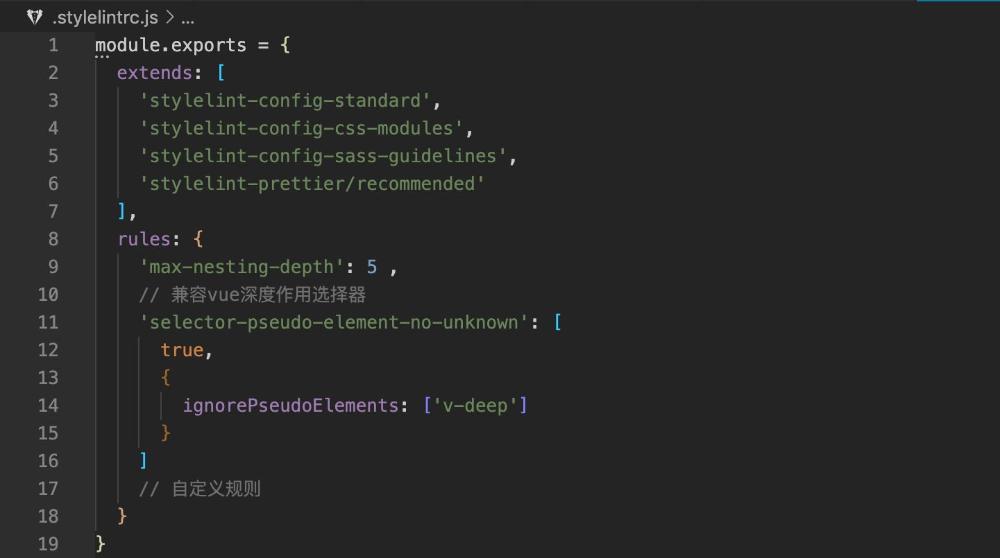

# specification

统一项目代码规范的命令行工具。该工具会对代码进行格式检查，保存代码文件时会按照统一规范自动格式化，提交代码时也会对本次修改、新增的文件进行检查，如果有文件的格式不满足规范，那么提交就会失败。同时该工具也会对 git commit 信息进行检查，如果提交信息不符合[Conventional Commits](https://www.conventionalcommits.org/en/v1.0.0/)规范，提交也会失败。

**扩展功能**

1. 图片压缩： 利用图片压缩工具 [imagemin](https://github.com/imagemin/imagemin)，和 `pre-commit` 钩子，在提交图片时对图片进行压缩处理

> **目前该工具只适合搭配 vscode 使用**

## 安装

```bash
# 正式版本
npm i -g @game/specification

# 内测版本，包含最新功能，稳定后会发布正式版
npm i -g @game/specification@beta
```

## 使用方法

```bash
# 进入到项目目录中执行spec命令
cd xx/xx/my-project
spec

# 或者在任意路径中执行spec命令，同时将项目目录当作参数传入
spec -p xx/xx/my-project

# 查看当前版本
spec -v
```

## 选项

|   名称    |   类型   | 必填 |        默认值        |                                      描述                                      |
| :-------: | :------: | :--: | :------------------: | :----------------------------------------------------------------------------: |
| -p/--path | `String` | `N`  | `运行命令的当前目录` | 要统一规范的工作目录，支持相对路径和绝对路径，相对路径相对于当前运行命令的目录 |

## 设置需要统一规范项目的特性

使用该工具时，需要先设置想使用统一规范项目的具体特性，比如是采用 js 编写的还是采用 ts 编写的，是否有样式文件等，然后工具会根据设置的项目特性安装特定的依赖包、生成特定的配置，针对特定的文件进行校验。


- js —— 表明项目使用 js 编写，只会校验`.js`、`.jsx`文件，不会校验`.ts`、`.tsx`文件
- ts —— 表明项目使用 typescript 编写，将会校验`.js`、`.jsx`、`.ts`、`.tsx`文件


- none —— 表明项目中不包含样式代码，将不会校验样式代码
- css —— 表明项目中样式采用纯 css 编写，将会校验`.css`文件和`.html`、`.vue`等文件中的样式部分，只允许普通 css 语法
- scss —— 表明项目中样式采用 scss 编写，将会校验`.css`、`.scss`文件和`.html`、`.vue`等文件中的样式部分，允许 scss 语法
- less **(v1.2.0+)** —— 表明项目中样式采用 less 编写，将会校验`.css`、`.less`文件和`.html`、`.vue`等文件中的样式部分，允许 less 语法


- 是 —— 表明项目为 vue 项目，将会校验`.vue`文件，包括`template`、`script`、`style`部分
- 否 —— 表明项目不是 vue 项目，将不会校验`.vue`文件


- 是 —— 表明项目中包含 html 文件，将会校验`.html`文件，包括`script`、`style`部分
- 否 —— 表明项目中不包含 html 文件，将不会校验`.html`文件

## 便捷生成规范化提交信息

工具会自动在项目`package.json`的`scripts`中添加`commit`命令，只需要执行`npm run commit`就可便捷的生成规范化的提交信息并自动提交，如下


## 实现细节

该工具主要由 vscode 插件、npm 包、配置文件相互配合实现所有功能。代码规范主要包含两部分，一部分是代码质量规范，比如不能使用`eval`、`new Function`之类的代码，另一部分则是代码外观规范，比如缩进是两个空格还是三个空格、一行最多多少字符之类的。该工具使用 prettier 来统一设置代码外观规范，使用 standard、 sass-guidelines 等标准来设置代码质量规范。

- vscode 插件

  - [eslint 插件](https://marketplace.visualstudio.com/items?itemName=dbaeumer.vscode-eslint)

    该插件的作用是在用户编写 js、ts（包括 vue、html 中的 script 部分）代码时，实时校验代码是否符合规范并给出警告或错误提示，当用户保存文件时自动修复代码。使用规范工具时会自动安装该插件。

  - [stylelint 插件](https://marketplace.visualstudio.com/items?itemName=stylelint.vscode-stylelint)

    该插件的作用是在用户编写 css、scss（包括 vue、html 中的 style 部分）等代码时，实时校验代码是否符合规范并给出警告或错误提示，当用户保存文件时自动修复代码。设置项目特性时，当 css 代码语言不为 none 时会自动安装该插件。

  - [prettier 插件](https://marketplace.visualstudio.com/items?itemName=esbenp.prettier-vscode)

    该插件的作用是对 json、md 等文件进行统一格式化，使用规范工具时会自动安装该插件。

  - [vetur 插件](https://marketplace.visualstudio.com/items?itemName=octref.vetur)

    该插件主要是对 vue 文件进行语法高亮、语法智能提示等。当项目为 vue 项目时，会自动安装该插件。

- npm 包

  - eslint@7
  - eslint-config-standard@16
  - eslint-plugin-import@2
  - eslint-plugin-node@11
  - eslint-plugin-promise@4
  - eslint-config-prettier@6
  - eslint-plugin-prettier@3
  - prettier@2
  - husky@4
  - lint-staged@10
  - commitizen@4
  - cz-conventional-changelog@3
  - @commitlint/cli@11
  - @commitlint/config-conventional@11

    上面这些包是始终会自动安装的。eslint、prettier 相关的包是用来进行 js 代码校验、格式化的；husky 用来配置 git 勾子，在提交代码时利用 lint-staged、eslint 对本次修改、新增的代码进行规范校验，同时利用 commitlint 对 git commit message 进行规范校验

  - typescript
  - @typescript-eslint/eslint-plugin@4
  - @typescript-eslint/parser@4
  - eslint-plugin-standard@4
  - eslint-config-standard-with-typescript@19

    上面这些包当 js 代码语言为 ts 时才会自动安装。@typescript-eslint/parser 是用来解析 ts 语法的；eslint-plugin-standard 用来设置 js 编码规范；@typescript-eslint/eslint-plugin、eslint-config-standard-with-typescript 用来设置 ts 编码规范

  - stylelint@13
  - stylelint-config-standard@20
  - stylelint-config-css-modules@2
  - stylelint-config-prettier@8
  - stylelint-prettier@1

    上面这些包当 css 代码语言不为 none 时才会自动安装，stylelint 用来校验样式代码，其他的包设置样式代码编码规范

  - stylelint-config-sass-guidelines@7

    上面这些包当 css 代码语言为 scss 时才会自动安装，用来设置 scss 编码规范

  - eslint-plugin-vue@7

    上面这些包当项目为 vue 项目时才会自动安装，用来设置 vue 文件的编码规范

  - eslint-plugin-html@6

    上面这些包当项目包含 html 时才会自动安装，用来设置 html 文件中 script 的编码规范

- 配置文件

  - .browserslistrc

    该文件用来配置项目兼容的浏览器版本，用户不应该再单独为 babel、postcss 等工具配置浏览器兼容版本，而是应统一使用该文件来进行浏览器兼容版本管控。除非不想使用统一的浏览器兼容版本，否则不应该修改该文件

  - .eslint-config.js
  - .eslintrc.js

    .eslint-config.js 用来设置 eslint 基础校验规则，.eslintrc.js 用来设置用户自定义规则。用不不应该修改.eslint-config.js，如果需要自定义规则，只需要修改.eslintrc.js，如下

    

  - .prettierrc.js

    该文件用来配置 prettier 格式化规则。如果用户需要修改代码外观规范，比如 js、css 的缩进是几个空格、单行最长字符数限制等，则可以修改该文件的配置，会对校验的文件统一生效

  - .stylelintrc.js

    该文件用来配置 stylelint 校验的规则，用户也可以在上面自定义规则，如下

    

  - .commitlint.config.js

    该文件为 commitlint 包的配置文件，用来配置 commitlint 校验 git commit 信息时以什么规范为准，**用户不能修改该文件**。

- .vscode/setttings.json

该文件用来设置 vscode 以及相关插件的行为，完整的配置如下。根据用户设置的项目特性的不同，内容也会有所不同

```json
{
  // 行尾字符，参考https://juejin.cn/post/6844904069304156168
  "files.eol": "\n",
  // 文件末尾插入空行
  "files.insertFinalNewline": true,
  // 文件保存时自动格式化
  "editor.formatOnSave": true,
  // 开启lint自动修复
  "editor.codeActionsOnSave": {
    "source.fixAll": true
  },
  // 设置prettier为所有文件的默认格式化器
  "editor.defaultFormatter": "esbenp.prettier-vscode",
  // 禁止prettier格式化js、ts、css、vue文件，统一使用eslint/stylelint
  "prettier.disableLanguages": ["javascript", "javascriptreact", "typescript", "typescriptreact", "css", "scss", "vue"],
  /**
   * 因为prettier禁用了对js/ts/css的校验，导致会使用内置格式器来格式化这些文件，从而跟eslint/stylelint冲突
   * 所以要禁用内置js/ts的格式化，统一使用eslint
   */
  "javascript.format.enable": false,
  "typescript.format.enable": false,
  "typescript.tsdk": "node_modules/typescript/lib",
  // 禁用内置css校验，统一使用stylelint
  "css.validate": false,
  "scss.validate": false,
  // 禁用vetur自动格式化，防止与lint自动修复冲突
  "vetur.format.enable": false,
  // 使用项目中的eslint包和配置，防止使用用户设置中配置的全局eslint
  "eslint.nodePath": "",
  "eslint.options": {
    "configFile": ""
  }
}
```

### .vscode/extensions.json

该文件配置项目中推荐使用的 vscode 插件，当用户下载了项目并且未使用该工具设置统一规范时，vscode 会弹框提示用户安装这些插件。

```json
{
  "recommendations": ["esbenp.prettier-vscode", "dbaeumer.vscode-eslint", "stylelint.vscode-stylelint", "octref.vetur"]
}
```

## 常见问题

- 为什么使用命令行工具后依然无法格式化文件？

  1. 可能 vscode 中本工作空间没有开启 eslint 插件的校验功能，如下

     

     此时点击底部状态栏中 ESLINT 图标，就会弹出如下对话框，点击 Allow 或者 Allow Everywhere 按钮就可以了

     

  2. 可能是用户设置的[vscode 用户设置](https://code.visualstudio.com/docs/getstarted/settings)与工具设置的[vscode 工作空间设置（.vscode/settings.json）](https://code.visualstudio.com/docs/getstarted/settings)的某些配置项冲突了，导致 vscode eslint 插件无法正常工作，此时需要修正用户设置中相关的配置项

  3. 如果排除原因 1、2 后还有问题，可能是一些其他的特殊原因导致的，此时可以尝试重启 vscode

- 安装时报如下错误

  

  这是 node 版本过低导致的，将 node 版本升到 >=10 就可以了

- 已经使用了 spec 命令初始化过的项目，想要变更项目特性时，如何再次设置统一规范？

  > 跟初次使用一样，直接在项目目录下运行`spec`命令就行了，会自动新增或者删除 npm 包、修改配置文件、修改 vscode 工作空间设置文件等。**提示：执行该命令时，最好先提交代码，这样既可以看到执行命令前后的差异，又可以防止误删代码的情况**
