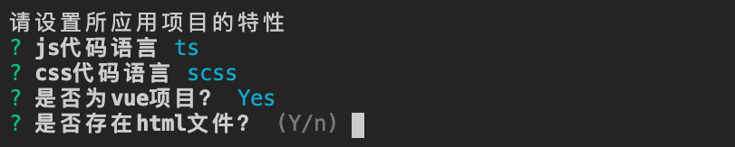

# specification

统一项目代码规范的命令行工具。该工具会对代码进行格式检查，保存代码文件时会按照统一规范自动格式化，提交代码时也会对本次修改、新增的文件进行检查，如果有文件的格式不满足规范，那么提交就会失败。同时该工具也会对 git commit 信息进行检查，如果提交信息不符合[Conventional Commits](https://www.conventionalcommits.org/en/v1.0.0/)规范，提交也会失败。

## 安装

```bash
npm i -g @game/specification
```

## 使用方法

```bash
cd xx/xx/my-project
spec
```

## 选项

|   名称    |   类型   | 必填 |        默认值        |                                      描述                                      |
| :-------: | :------: | :--: | :------------------: | :----------------------------------------------------------------------------: |
| -p/--path | `String` | `N`  | `运行命令的当前目录` | 要统一规范的工作目录，支持相对路径和绝对路径，相对路径相对于当前运行命令的目录 |

## 设置需要统一规范项目的特性

使用该工具时，需要先设置想使用统一规范项目的具体特性，比如是采用 js 编写的还是采用 ts 编写的，是否有样式文件等，然后工具会根据设置的项目特性安装特定的依赖包、生成特定的配置，针对特定的文件进行校验。


- js —— 只会校验`.js`、`.jsx`文件，不会校验`.ts`、`.tsx`文件
- ts —— 会校验`.js`、`.jsx`、`.ts`、`.tsx`文件


- none —— 不会校验样式代码
- css —— 会校验样式代码，包括`.css`、`.scss`等样式文件和`.html`、`.vue`等文件中的样式部分，只允许普通 css 语法
- scss —— 会校验样式代码，包括`.css`、`.scss`等样式文件和`.html`、`.vue`等文件中的样式部分，允许 scss 语法


- 是 —— 会校验`.vue`文件，包括`template`、`script`、`style`部分
- 否 —— 不会校验`.vue`文件



- 是 —— 会校验`.html`文件，包括`script`、`style`部分
- 否 —— 不会校验`.html`文件

## 便捷生成规范化提交信息

工具会自动在项目`package.json`的`scripts`中添加`commit`命令，只需要执行`npm run commit`就可便捷的生成规范化的提交信息并自动提交，如下


